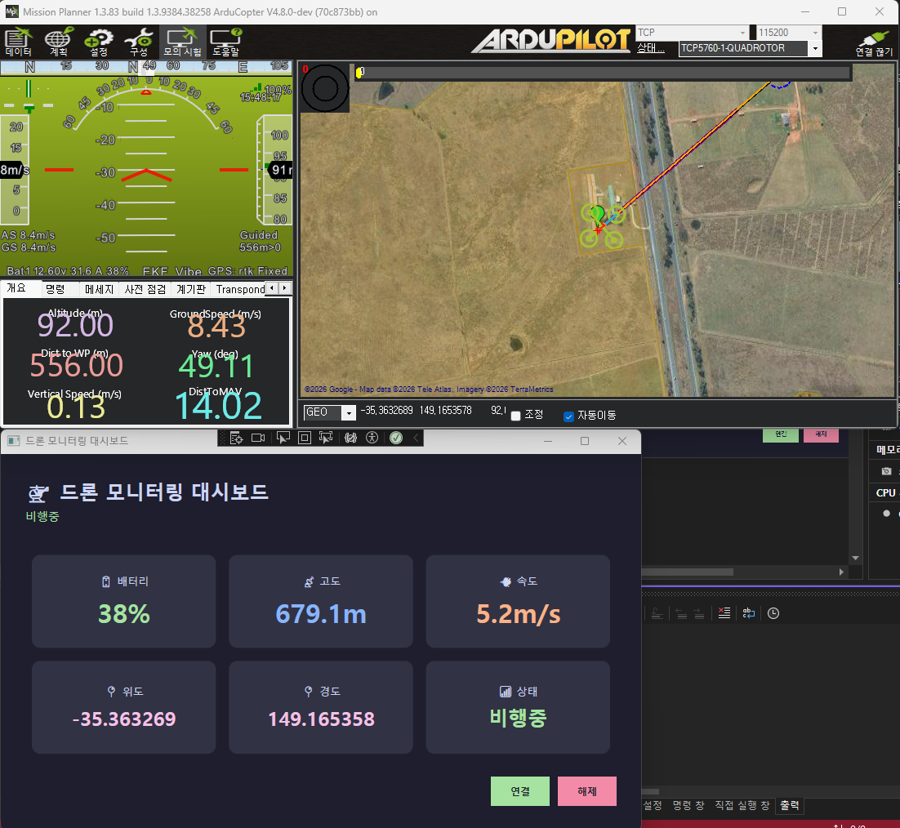

# 🚁 DroneMonitor

WPF + MVVM 패턴으로 구현한 실시간 드론 모니터링 대시보드입니다.
ArduPilot SITL과 MAVLink 프로토콜을 활용하여 가상 드론의 실시간 데이터를 수신하고 시각화합니다.

## 기술 스택

- **Language**: C# / .NET 8
- **UI Framework**: WPF (Windows Presentation Foundation)
- **Architecture**: MVVM (Model-View-ViewModel)
- **MVVM Library**: CommunityToolkit.Mvvm
- **Protocol**: MAVLink v2
- **Simulator**: ArduPilot SITL + Mission Planner

## 아키텍처

DroneMonitor/
├── Models/
│   └── DroneStatus.cs        # 드론 상태 데이터 모델
├── ViewModels/
│   └── MainViewModel.cs      # UI 바인딩 및 커맨드 처리
├── Views/
│   └── MainWindow.xaml       # 대시보드 UI
└── Services/
└── MavLinkService.cs     # MAVLink UDP 통신 및 파싱

## 주요 기능

- MAVLink v2 프로토콜 실시간 파싱
- UDP 소켓 통신으로 드론 데이터 수신
- 실시간 대시보드 UI 업데이트 (배터리, 고도, 속도, GPS)
- 연결/해제 버튼으로 통신 제어
- MVVM 패턴으로 UI와 비즈니스 로직 분리

## 실행 방법

### 사전 준비
1. [Mission Planner](https://ardupilot.org/planner/docs/mission-planner-installation.html) 설치
2. Mission Planner → 모의시험 → 멀티로터 실행
3. 구성 → Advanced → MAVLink이중화 → UDP Outbound → Port: 14553, Host: 127.0.0.1 설정

### 앱 실행
1. Visual Studio에서 프로젝트 열기
2. F5로 실행
3. **연결** 버튼 클릭

## 데이터 흐름
ArduPilot SITL → Mission Planner → UDP 14553 → MavLinkService → ViewModel → UI

## MAVLink 파싱 메시지

| MSG ID | 메시지 | 데이터 |
|--------|--------|--------|
| 0 | HEARTBEAT | 드론 상태 |
| 33 | GLOBAL_POSITION_INT | 위도, 경도, 고도, 속도 |
| 147 | BATTERY_STATUS | 배터리 잔량 |

## 스크린샷

## 개발 과정

### WSL SITL 시도
처음에는 ArduPilot SITL을 WSL2(Ubuntu)에서 실행하여 MAVLink 데이터 수신을 시도했습니다.
- MAVLink v2 프로토콜 파싱 구현 완료
- UDP 실시간 데이터 수신 성공
- WSL2 시간 동기화 문제(`Warning, time moved backwards`)로 인해 드론 시뮬레이션이 정상 작동하지 않음

### Mission Planner로 전환
WSL2 시간 문제 해결을 위해 Mission Planner SITL로 전환했습니다.
- Windows 네이티브 환경으로 시간 동기화 문제 해결
- MAVLink이중화 기능으로 UDP 14553 포트로 데이터 포워딩
- 실제 드론 이륙/비행 시뮬레이션 성공
- 배터리, 고도, 속도, GPS 실시간 데이터 수신 확인